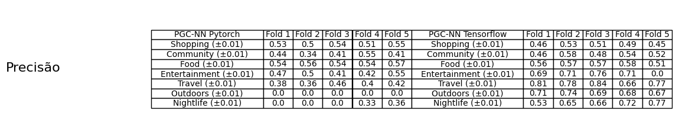
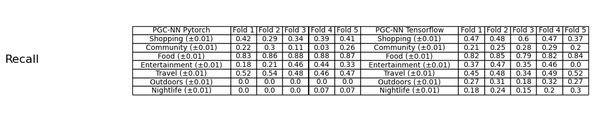
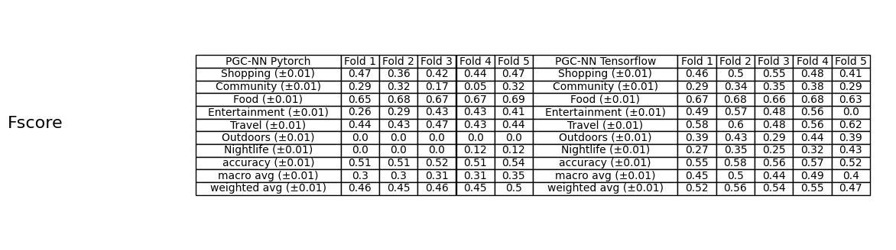
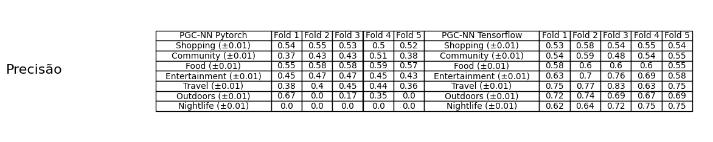
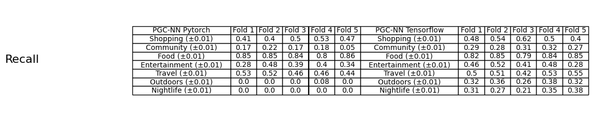
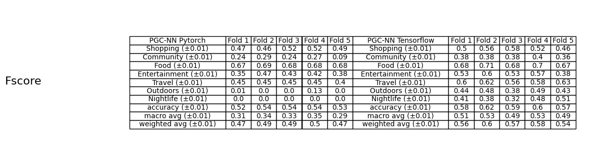

## Relatório: Transformação do PGC-NN de Tensorflow para Pytorch

### Principais Diferenças no Modelo GNNUS_BaseModel

1. **Camada ARMAConv**:
    - **TensorFlow**:
      
      -Implementada com a biblioteca Spektral.
      
      -Recebe como parâmetro o tamanho do input e output
      
      -Recebe como parâmetro as funções de ativação da camada e da Graph Convolutional Network(GCN)
      
      -Entrada: `(node features)`,`(normalized and rescaled Laplacian)`

    - **PyTorch**:
      
    -Implementada com a biblioteca Pytorch Geometric.

    -Recebe como parâmetro o tamanho do input e output
   
    -Recebe como parâmetro as funções de ativação da Graph Convolutional Network(GCN)
   
    -Entrada: `(node features),(edge indices),(edge weights)`

2. **Camada Densa**:
   
    - **TensorFlow**: Usa camadas `Dense` para representar camadas Densas.

    - **PyTorch**: Usa camadas `Linear` para representar camadas Densas.

3. **Variáveis de Multiplicação**:
   
    - **TensorFlow**: Usa `tf.Variable` para fazer a multiplicação de certos resultados.

    - **PyTorch**: Usa `torch.tensor` para fazer a multiplicação de certos resultados.

4. **Ativação das Camadas**:
   
    - **TensorFlow**: Feita de forma interna (dentro das camadas).

    - **PyTorch**: Feita de forma externa com `torch.nn.functional`.

5. **Inicialização e Forward Pass**:
    
    - **Tensorflow**: A inicialização das camadas e o fluxo de dados é feita diretamente na função `build`.

    - **PyTorch**: A inicialização das camadas e a definição do fluxo de dados exigem que se sigam as
      convenções de `nn.Module`, separando claramente a construção das camadas (em `__init__`) e a lógica de passagem
      dos dados (em `forward`). Isso, em consequência, altera a forma como os próprios dados são acessados se comparado com o modelo feito em Tensorflow.

    

### Principais Mudanças no Treino e na Avaliação

1. **Conversão de Dados**:
    - **TensorFlow**: Os dados são manipulados em matrizes `numpy` diretamente.

    - **PyTorch**: Os dados devem ser convertidos em tensores utilizando `torch.tensor` e movidos para o dispositivo
      apropriado (em ordem de disponibilidade: MPS, GPU, CPU) utilizando `.to(device)` durante o treino.

2. **Compilação e Treinamento do Modelo**:
   
    - **TensorFlow**: O modelo é compilado com um otimizador, função de perda e métricas, e treinado
      utilizando `model.fit`.

    - **PyTorch**: 
      - A configuração do treinamento envolve definir explicitamente o critério de perda e o otimizador. O
      treinamento é realizado através de loops de época e batch, onde são aplicados backpropagation e otimização.

       - É utilizado das mesmas funções de perda e otimizador do tensorflow, mas em um formato compatível com Pytorch.

3. **DataLoader**:
   
    - **TensorFlow**: Utiliza diretamente os arrays `numpy` representando as matrizes de adjacência, sem precisar de DataLoader.

    - **PyTorch**: Utiliza `torch.utils.data.TensorDataset` e `torch_geometric.data.DataLoader` para manusear os dados em mini-batches e mandá-los para o modelo apropriadamente.

4. **Avaliação do Modelo**:
   
    - **TensorFlow**: A avaliação é feita durante o treinamento com `model.evaluate`.

    - **PyTorch**: A avaliação é feita em um loop separado na função `evaluate_model`, utilizando `torch.no_grad()` para desativar o
      cálculo do gradiente durante a inferência.

5. **Redução da taxa de Aprendizado**:
   
    - Foi utilizado `torch.optim.lr_scheduler.ReduceLROnPlateau` para fazer uma redução gradual da taxa de aprendizado do modelo caso não haja melhoras significativas (um limite determinado por `threshold`) em um número de épocas determinado como `patience` para uma determinada métrica, a taxa de aprendizado é então reduzida em um valor do parâmetro `factor`. Mesmo não sendo crucial para o funcionamento do modelo, a redução da taxa de aprendizado é uma boa prática para que o modelo prossiga para um maior desempenho.

### Mudanças na entrada do Modelo GNNUS_BaseModel para Pytorch

1. **Matrizes de Adjacência**
   
  - O modelo em Pytorch, mesmo recebendo as mesmas matrizes de adjacência que o modelo em tensorflow, precisou utilizar uma versão modificada delas.

  - A camada `torch_geometric.nn.conv.ArmaConv` do Pytorch possui uma entrada de tamanho `(2,E)` para os índices de vértice , diferente da camada `spektral.layers.convolutional.ArmaConv`. 

  - O modelo em Pytorch recebe entradas dessa forma pois por padrão deve receber duas listas, dos nós de entrada e de saída.

  - Já o modelo em Tensorflow recebe matrizes de adjacência e as outras entradas, sem precisar de nenhuma manipulação sob elas.

  - Para atender ao novo tipo de entrada, foi utilizado uma nova função  `prepare_pyg_batch()` que recebe as entradas, matrizes de adjacência, e retorna
  as 2 listas, além de uma lista de pesos dos vértices.

  - A lista de pesos dos vértices é usada como entrada na camada ArmaConv do Pytorch Geometric, e é criada com base na matriz de adjacência, sendo esse o motivo pelo qual não é uma entrada da ArmaConv do Spektral.

2. **Entradas temporais e de espaço do modelo**

  - As outras entradas do modelo sofreram uma transformação de dimensão, reduzindo as suas dimensões para atenderem ao valor de entrada `input.size(0) * input.size(1),input.size(2)`.

  - Essa mudança, assim como a anterior, também foi necessária para o funcionamento com a camada ArmaConv do Pytorch Geometric.

### Dados

#### Output dos modelos

1. **Métricas de precision, fscore e recall**

- Após o treinamento dos modelos, eles retornam as métricas `precision`, `fscore` e `recall` para cada uma das 7 categorias. Essas três métricas medem o desempenho de cada modelo em um aspecto distinto. Sendo `VP` verdadeiros positivos, ou seja, valores que o modelo mediu corretamente, `FP` falsos positivos, ou seja,  valores que o modelo previu como positivos, mas que na realidade são negativos e `FN` falsos negativos, ou seja, valores que o modelo previu como negativos, mas que na realidade são positivos. É visto a seguir como as ditas métricas funcionam.

- Precisão = (Va)/(VP + FP)
- Fscore = 2 * (VP) / (VP + 0.5 * (FP + FN))
- Recall = (VP)/(VP + FN)

#### Comparação dos resultados dos modelos de Tensorflow e Pytorch

- A base de comparação entre os modelos são as saídas dos modelos disponíveis na pasta `output` no final da execução, sendo as saídas `precision.csv`,`recall.csv` e `fscore.csv`, possuindo um `n` número de linhas (correspondendo ao número de folds, por padrão 5) e 7 colunas (correspondendo às 7 categorias).
Além dessas saídas, também é usado como comparação os gráficos de perda e a acurácia gerados para cada fold, disponível também na pasta "output" no final da execução.

- Os modelos são comparados com o mesmo número de épocas e o mesmo tamanho de batch, para não haver discrepâncias.

- A comparação entre as métricas é feita da seguinte forma.
  
   1. **Valor Médio de Categorias em cada métrica por fold**
   
   - É feita uma média dos valores de uma certa categoria para cada fold e para cada métrica,gerando assim um valor médio do modelo sobre aquela métrica e categoria em específico.

   - Feito isso, os valores médios de cada categoria e de cada métrica são comparados por histogramas, sendo possível assim notar se a diferença entre os resultados dos dois modelos é notória.

  2. **Valor Específico de categorias em cada métrica por fold**

    - É também analisado o valor de uma certa categoria por fold para cada métrica.

    - Assim, os valores de cada fold para cada métrica e cada categoria são comparados por histogramas.
 
    - Para garantir o uso dos mesmos folds por modelo, foi utilizado da biblioteca `joblib` para salvar os k_folds dos índices utilizados pelos modelos em Pytorch durante o treino. Após isso,
foi utilizado da biblioteca `pickle` para carregar os arquivos `.pkl`, separados pelo tipo de semana `week.pkl`,`weekend.pkl` e `all_week.pkl`, para os modelos em Tensorflow.
Isso foi feito a comparação entre os dois modelos com dados similares, tendo em vista que os k_folds separam os índices aleatoriamente, feito com todas as combinações de `batch_size` e `epochs` em cada Estado, não sendo repetidos entre si.

  **Análise da Perda e Acurácia dos Modelos**
  - Além das análises das 3 métricas, também é analisado o valor da perda e da acurácia dos modelos. 

  - Assim, os gráficos são comparados entre os dois modelos para que seja possível ver se seguem por um mesmo caminho (para a diminuição da perda ao longo das épocas).

## Resultados Obtidos 

  - Para a análise dos resultados obtidos entre os dois modelos, foi utilizado os Estados `Alabama`, `Arizona` e `Virginia` para comparação, todos dos Estados Unidos (US). Foi utilizado como número de épocas para cada fold dos modelos `50` e `100`. Além disso, foi utilizado como tamanho de batch `36` e `48`.
  - Foi construído uma tabela para cada combinação de tamanho de batch e épocas para cada Estado, para fins de comparação das 3 métricas para cada categoria.
  - Cada tabela possui outras 3 tabelas distintas , cada uma mostrando os resultados de uma certa métrica. Cada tabela possui 10 colunas, representando os 5 folds dOS dois modelos PGC-NN.
  - A seguir, todas as tabelas serão mostradas.

###Alabama
- Tamanho de Batch 36
- 
    --Número de Épocas 50
  
  

  

  

    --Número de Épocas 100

  

  

  

- Tamanho de Batch 48
  

  Os resultados obtidos podem ser vistos no seguinte [notebook .ipynb](https://github.com/TarikSalles/PGC_NN_Resultados_Alabama/blob/main/Comparacao_Metricas_PGC_Alabama_Arizona_Virginia.ipynb).
  
